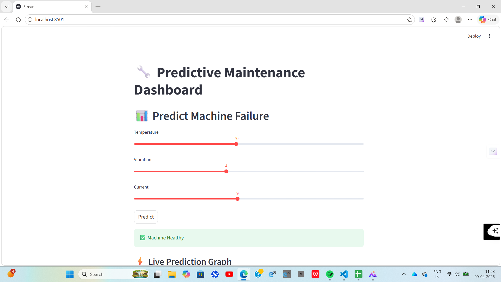
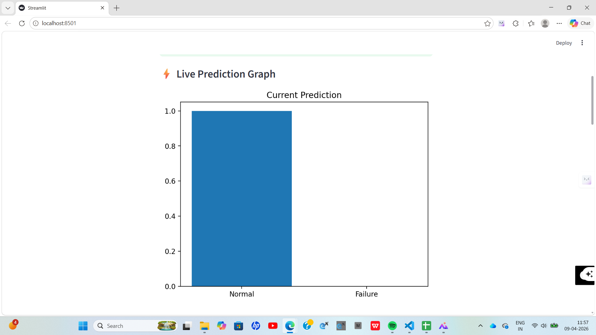
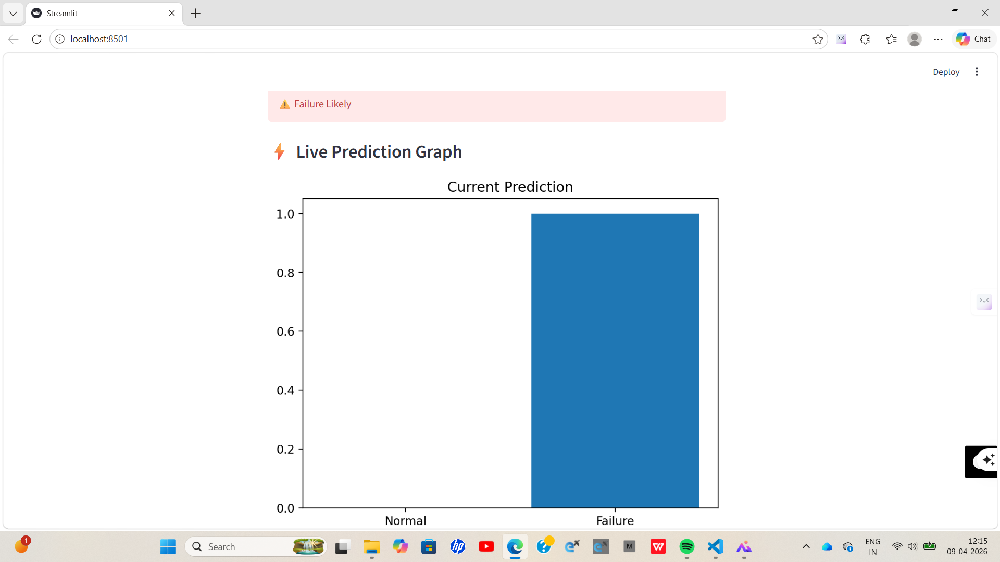
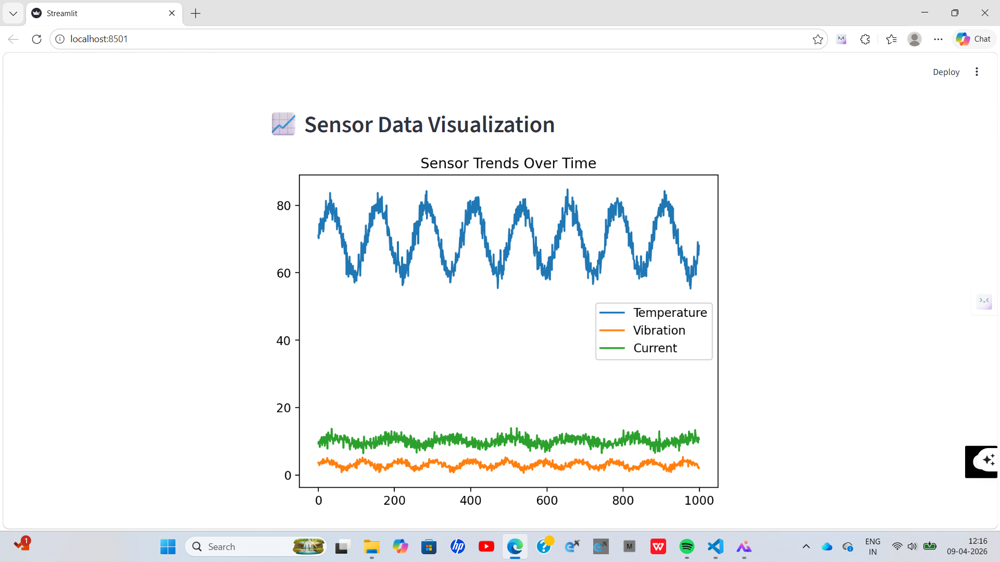
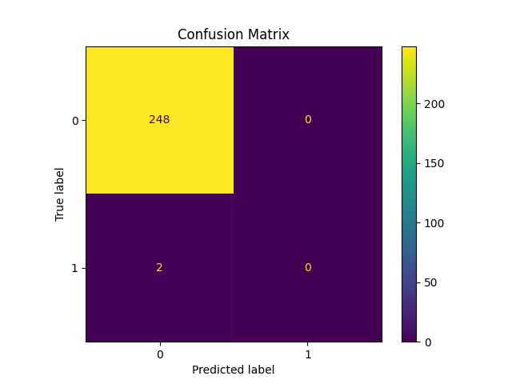
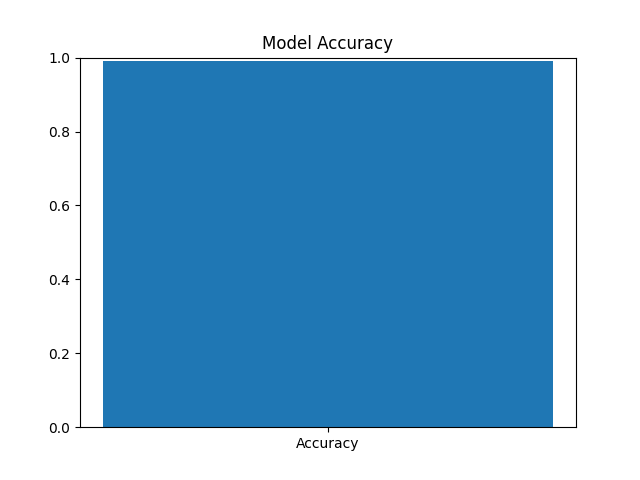

# 🚀 AI-Powered Predictive Maintenance System for IoT Devices

---

## 📌 Overview

This project is an end-to-end AI system that predicts machine failures before they occur using IoT sensor data.

It combines:
- Machine Learning (Random Forest)
- Deep Learning (LSTM for time-series)
- Flask API for real-time predictions
- Streamlit dashboard for visualization

The goal is to reduce downtime, improve efficiency, and enable smart maintenance in industrial systems.

---

## 🎯 Problem Statement

Traditional maintenance strategies:
- Reactive → Fix after failure (costly)
- Preventive → Scheduled maintenance (inefficient)

Problems:
- Unexpected machine breakdowns
- High maintenance costs
- Production downtime

👉 Solution:  
This system predicts failures in advance using sensor data such as:
- Temperature
- Vibration
- Current

---

## 🏭 Industry Relevance

Predictive maintenance is widely used in:

- Manufacturing plants
- Power generation systems
- Automotive industry
- Aviation industry

Companies using similar systems:
- Siemens
- Bosch
- General Electric
- Tesla

Benefits:
- Reduced downtime (15–20%)
- Lower maintenance costs
- Increased equipment lifespan

---

## ⚙️ Tech Stack

| Category | Tools |
|--------|------|
| Programming | Python |
| Data Processing | Pandas, NumPy |
| Machine Learning | Scikit-learn (Random Forest) |
| Deep Learning | TensorFlow / Keras (LSTM) |
| Visualization | Matplotlib |
| Backend API | Flask |
| Frontend Dashboard | Streamlit |

---

## 📊 Dataset (Simulated IoT Sensor Data)

This project uses a **simulated IoT sensor dataset**.

The dataset contains sensor readings used for predictive maintenance:

### Features:
- Temperature → detects overheating
- Vibration → detects mechanical faults
- Current → detects electrical anomalies

### Target:
- Failure (0 = Normal, 1 = Failure)

### Dataset Type:
- Time-series data for LSTM model  
- Tabular data for Random Forest  

---

## 🏗️ Architecture

Sensor Data (IoT Inputs)  
→ Data Preprocessing  
→ Feature Engineering  
→ Random Forest Model (Baseline Prediction)  
→ LSTM Model (Time-Series Analysis)  
→ Prediction (Failure / Normal)  
→ Flask API (Backend Service)  
→ Streamlit Dashboard (Visualization & User Interface)

This architecture enables real-time predictive maintenance using IoT sensor data and machine learning models.
---

## ⚙️ Installation

### Step 1: Clone Repository

git clone <your-repo-link>
cd AI-Predictive-Maintenance-IoT

### Step 2: Create Virtual Environment (Python 3.10)

py -3.10 -m venv venv
.\venv\Scripts\activate

### Step 3: Install Dependencies

pip install pandas numpy scikit-learn matplotlib seaborn tensorflow flask streamlit joblib

---

## ▶️ Usage

### 1️⃣ Generate Dataset

python data/generate_dataset.py

### 2️⃣ Train Random Forest Model

python src/main.py

### 3️⃣ Train LSTM Model

python src/lstm_model.py

### 4️⃣ Run Dashboard

streamlit run dashboard.py

---

## 📊 Results

The system was tested using simulated IoT sensor data.

- The Random Forest model achieved approximately **99% accuracy**
- The LSTM model also showed high accuracy on time-series data

### Key Observations:
- The system correctly predicts machine health (Healthy / Failure)
- Sensor trends are visualized effectively
- Failure distribution shows imbalance in dataset (more normal cases)
- The system demonstrates how predictive maintenance can reduce downtime and maintenance costs

The dashboard enables real-time prediction using sensor inputs.

---

## 📸 Screenshots

### 🔹 Dashboard UI

### 🔹 Prediction Output (Healthy Case)

### 🔹 Prediction Output (Failure Case)

### 🔹 Sensor Data Visualization

### 🔹 Confusion Matrix

### 🔹 Accuracy Graph

---

## 🎓 Learning Outcomes

Through this project, I learned:

- Time-series modeling using LSTM  
- Difference between Machine Learning and Deep Learning models  
- Data preprocessing and feature engineering  
- Building end-to-end AI systems  
- Creating APIs using Flask  
- Developing dashboards using Streamlit  
- Debugging real-world environment issues  

---

## 🚀 Conclusion

This project demonstrates a complete AI-based predictive maintenance system that is:

✔ Industry-relevant  
✔ Scalable  
✔ Practical  
✔ Deployment-ready  

It showcases how AI can transform traditional maintenance into intelligent, data-driven systems.

---

## ⭐ If you like this project  
Give it a ⭐ on GitHub!